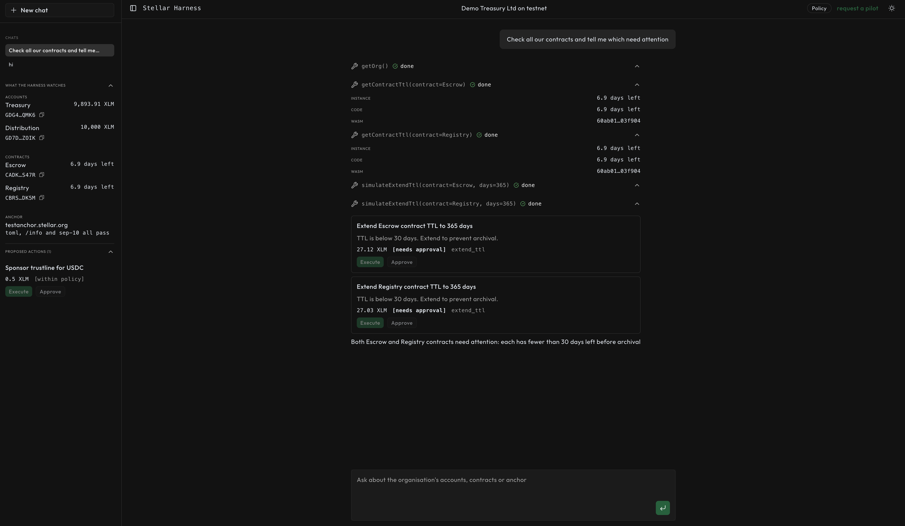

# Stellar Harness

An operator agent for one organisation on Stellar. It watches the organisation's accounts, contracts and anchor, explains what it finds, simulates each fix to get its real cost, and proposes it as an action that is either within the organisation's policy or needs approval.

Live: https://stellarharness.xyz



## Run it

```bash
pnpm install
cp .env.example .env
docker compose up -d postgres
pnpm dev
```

Set `OPENAI_API_KEY` in `.env`. The app runs at http://localhost:3000.
